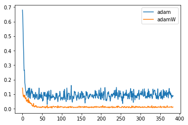
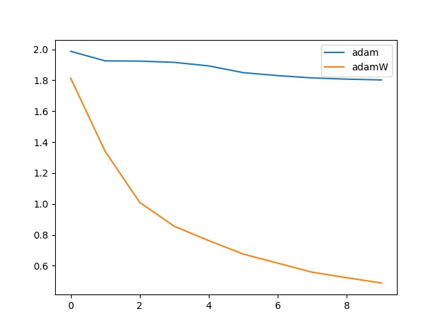
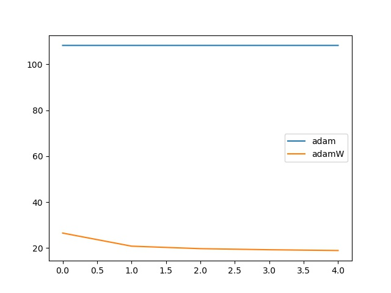

## Introduction

Experiment on AdamW described in [*Fixing Weight Decay Regularization in Adam*](https://arxiv.org/abs/1711.05101) , which analyzed the implementations on current framework and point out a bug. Then they proposed **AdamW** to figure out this bug. 

In the paper mentioned above, the author shows that $L_2$ regularization and weight decay regularization are equivalent for standard SGD but not for adaptive gradient algorithms. i.e. Adam.

And most current implementation of Adam take the approach of $L_2$ . So we need to fix it with normal weight decay approach.

Notice that if you do **not use weight decay** ( weight_decay == 0), this bug is free for you.


## Usage

for simple classification

```bash
$ jupyter notebook
# then open adam_adamW_simple.ipynb
```

for cifa10

```bash
$ cd cifar
$ python main.py
```

for auto encoder

```bash
$ cd autoencoder
$ python main.py
```


## Details


I delete the $w x_{t-1}$ in line 6 and add it to line 12. In pytorch, which is like this

```
p.data.addcdiv_(-step_size, exp_avg, denom) # L2 approach

#  -> weight decay approach
p.data.add_(-step_size,  torch.mul(p.data, group['weight_decay']).addcdiv_(1, exp_avg, denom) )
```


## Results

All the results are under weight_decay = 0.1

- simple classification problem



- cifar10 on VGG19

lr = 0.001

Initially the lr was set to 0.1, in this way we found that model under the Adam optimizer will not converge but AdamW will get converged. This means the figuration of Adam and AdamW can be various.



- Auto encoder on mnist dataset to 2d vector




### REF

The simple classification is from [ref](https://morvanzhou.github.io/tutorials/machine-learning/torch/3-06-optimizer/)

The cifar10 baseline is from  [pytorch-cifar]( https://github.com/kuangliu/pytorch-cifar)
